# Esetti - System Zarządzania Kołami Naukowymi i Generowania Dokumentacji

## Metadane Projektu
* **Uczelnia:** Uniwersytet Rzeszowski
* **Instytut:** Instytut Informatyki
* **Kierunek:** Informatyka, II rok
* **Przedmiot:** Programowanie Obiektowe 2 (lata akademickie 2025/2026)
* **Prowadzący:** mgr inż. Wojciech Gałka
* **Wykonawca:** Kacper Ręczak (Nr albumu: 134968)
* **Miejsce i rok:** Rzeszów, 2026

---

## 1. Wstęp i Cel Projektu
Esetti to zaawansowany system desktopowy przeznaczony do wspomagania zarządzania kołami naukowymi oraz generowania powiązanej z ich działalnością dokumentacji. System został zaprojektowany z myślą o centralizacji informacji o strukturze organizacyjnej, członkach kół, realizowanych projektach oraz wydarzeniach naukowych. 

Kluczowym założeniem projektowym na poziomie bazy danych jest elastyczność i skalowalność. Struktura relacji została opracowana w taki sposób, aby w przyszłości bez zmian w schemacie danych możliwe było przeniesienie logiki do chmurowej aplikacji webowej o charakterze międzyuczelnianym i ogólnopolskim. Dzięki temu pojedyncze instancje projektów czy wydarzeń mogą być współdzielone przez różne koła naukowe z wielu wydziałów i uczelni.

## 2. Architektura i Stos Technologiczny
Aplikacja została zrealizowana w architekturze trójwarstwowej z wyraźnym wydzieleniem odpowiedzialności.

### 2.1. Uzasadnienie Wyboru Technologii
* **C# i .NET 10.0:** Zapewnia wysoką wydajność, bezpieczeństwo typów oraz dostęp do potężnego ekosystemu bibliotek.
* **Avalonia UI:** Wybrana zamiast przestarzałego WPF ze względu na jej wieloplatformowość (działa na Windows, Linux, macOS) oraz nowoczesne podejście do renderowania UI.
* **SQLite:** Lekka, bezserwerowa relacyjna baza danych. Idealna dla aplikacji desktopowej, ponieważ nie wymaga od użytkownika instalacji i konfiguracji zewnętrznego serwera bazodanowego, oferując jednocześnie pełne wsparcie dla języka SQL.
* **QuestPDF:** Nowoczesna biblioteka do generowania dokumentów PDF z poziomu kodu (Fluent API), niewymagająca użycia powolnych silników konwersji HTML do PDF.

### 2.2. Zastosowane Wzorce Projektowe
Aplikacja jest zgodna z dobrymi praktykami programowania obiektowego (OOP) i w pełni wykorzystuje zaawansowane wzorce projektowe:
* **MVVM (Model-View-ViewModel):** Architektura oddzielająca logikę biznesową (ViewModel) od interfejsu użytkownika (View). Widoki są całkowicie pozbawione logiki, a interakcja odbywa się poprzez mechanizmy wiązania danych (Data Binding) oraz komendy (`RelayCommand` z pakietu `CommunityToolkit.Mvvm`).
* **Wstrzykiwanie Zależności (Dependency Injection - DI):** Zastosowano wbudowany kontener IoC (`Microsoft.Extensions.DependencyInjection`). Zapewnia to luźne powiązanie (loose coupling) pomiędzy klasami i odwrócenie sterowania. Serwisy i repozytoria są wstrzykiwane bezpośrednio do konstruktorów ViewModeli jako singletony lub instancje tymczasowe.
* **Wzorzec Repozytorium (Repository Pattern):** Dostęp do bazy danych został wyabstrahowany do dedykowanych klas repozytoriów (np. `ClubRepository`, `MemberRepository`). Ukrywa to logikę zapytań Entity Framework Core przed ViewModelami, ułatwiając potencjalną wymianę źródła danych na zewnętrzne API w przyszłości.

## 3. Struktura Bazy Danych i Skalowalność Międzyuczelniana
Schemat bazy danych (zdefiniowany w `EssetiDbContext`) uwzględnia architekturę wielodostępną (multi-tenant) na poziomie struktur akademickich:

* **Struktura Uczelniana (`College` $\rightarrow$ `CollegeDepartment` $\rightarrow$ `ClubInfo`):** System wspiera definicję wielu uczelni, z których każda dzieli się na wydziały, a te z kolei grupują poszczególne koła naukowe.
* **Współpraca Międzyuczelniana w Projektach:** Encje takie jak `Project` oraz `Trip` są powiązane relacjami wiele-do-wielu z encją `ClubInfo` (tabele łączące). Pozwala to na realizację projektów partnerskich, w których uczestniczą członkowie z różnych kół naukowych, także z różnych uczelni.
* **Członkostwo i Uprawnienia (`Member`, `UserAccount`, `AuthorityRole`, `MemberClub`):** Użytkownik posiada jedno konto systemowe (`UserAccount`), lecz może być przypisany do wielu kół naukowych z różnymi poziomami uprawnień i rolami (np. prezes w jednym kole, a zwykły członek w innym) poprzez tabelę łączącą `MemberClub`.

### 3.1. Szczegółowy Opis Schematu Bazy Danych (O/RM)
Baza danych składa się z tabel reprezentujących strukturę uczelnianą, dane użytkowników oraz logikę operacyjną kół naukowych. Relacje wiele-do-wielu zostały zaimplementowane za pomocą tabel pośredniczących (łączących).

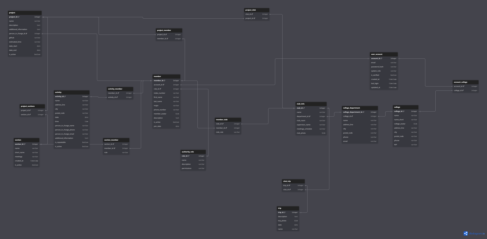
*Rysunek 1: Schemat relacji bazy danych systemu Esetti.*

#### 3.1.1. Tabele Struktur Akademickich
* **`college` (Uczelnia):**
  * `college_id` (PK, int): Unikalny identyfikator uczelni.
  * `name` (string): Pełna nazwa uczelni.
  * `name_short` (string): Skrócona nazwa uczelni.
  * `college_avatar` (blob/byte[]): Logotyp uczelni.
  * `address_line`, `city`, `postal_code` (string): Dane adresowe siedziby.
  * `phone` (string): Numer telefonu kontaktowego.
  * `NIP` (string): Numer Identyfikacji Podatkowej.
* **`college_department` (Wydział):**
  * `college_department_id` (PK, int): Unikalny identyfikator wydziału.
  * `college_id` (FK, int): Powiązanie z tabelą `college`.
  * `name` (string): Pełna nazwa wydziału.
  * `address_line`, `city`, `postal_code`, `phone`, `email` (string): Dane adresowe i kontaktowe wydziału.
* **`club_info` (Koło Naukowe):**
  * `club_id` (PK, int): Unikalny identyfikator koła.
  * `name` (string): Pełna nazwa koła naukowego.
  * `department_id` (FK, int): Powiązanie z wydziałem (`college_department`).
  * `club_room` (string): Sala/pokój przypisany do koła.
  * `supervisor_name`, `supervisor_email`, `supervisor_phone` (string): Dane opiekuna koła.
  * `meetings_schedule` (string): Harmonogram cyklicznych spotkań.
  * `short_name` (string): Skrócona nazwa koła.
  * `club_photo` (blob/byte[]): Zdjęcie/logotyp koła naukowego.

#### 3.1.2. Tabele Użytkowników i Uprawnień
* **`user_account` (Konto Użytkownika):**
  * `account_id` (PK, int): Unikalny identyfikator konta.
  * `email` (string): Adres e-mail (login, unikalny).
  * `password_hash` (string): Zahaszowane hasło dostępowe.
  * `system_role` (string): Rola w systemie (np. SuperAdmin, CollegeAdmin, User).
  * `is_verified` (bool): Flaga weryfikacji konta.
  * `created_at`, `last_login`, `updated_at` (datetime): Metadane dotyczące aktywności na koncie.
* **`member` (Członek Koła):**
  * `member_id` (PK, int): Unikalny identyfikator członka.
  * `account_id` (FK, int): Opcjonalne powiązanie z kontem logowania (`user_account`).
  * `role_id` (FK, int): Powiązanie z uprawnieniami w kole (`authority_role`).
  * `index_number` (string): Numer albumu (indeksu).
  * `first_name`, `last_name` (string): Dane personalne.
  * `major` (string): Kierunek studiów.
  * `phone_number` (string): Telefon kontaktowy.
  * `member_avatar` (blob/byte[]): Zdjęcie profilowe.
  * `description` (string): Krótki opis/biografia członka.
  * `is_active` (bool): Status aktywności w kole.
  * `join_date` (datetime): Data dołączenia do organizacji.
* **`authority_role` (Role i Uprawnienia):**
  * `role_id` (PK, int): Unikalny identyfikator roli.
  * `name` (string): Nazwa roli (unikalna).
  * `description` (string): Szczegółowy opis.
  * `permissions` (string): Uprawnienia przypisane do roli.

#### 3.1.3. Tabele Działań i Operacji
* **`project` (Projekt Badawczy):**
  * `project_id` (PK, int): Unikalny identyfikator projektu.
  * `name` (string): Nazwa projektu.
  * `description`, `additional_information` (string): Opis oraz informacje dodatkowe.
  * `person_in_charge_id` (FK, int): Powiązanie z członkiem koła pełniącym funkcję kierownika projektu (`member`).
  * `github` (string): Link do repozytorium kodu.
  * `estimated_time` (int): Szacowany czas realizacji (np. w godzinach).
  * `date_start`, `date_end` (datetime): Ramy czasowe projektu.
  * `is_active` (bool): Status aktywności projektu.
* **`section` (Sekcja Koła):**
  * `section_id` (PK, int): Unikalny identyfikator sekcji.
  * `name` (string): Nazwa sekcji (np. sekcja programistyczna).
  * `short_name` (string): Nazwa skrócona.
  * `meetings` (string): Terminy spotkań sekcji.
  * `created_at` (datetime): Data utworzenia.
  * `is_active` (bool): Status aktywności.
* **`activity` (Wydarzenie/Aktywność):**
  * `activity_id` (PK, int): Unikalny identyfikator aktywności.
  * `name` (string): Nazwa wydarzenia.
  * `address_line`, `city`, `postal_code` (string): Dane lokalizacji wydarzenia.
  * `date`, `time` (datetime/string): Data i godzina wydarzenia.
  * `person_in_charge_name`, `person_in_charge_phone`, `person_in_charge_email` (string): Dane koordynatora wydarzenia.
  * `additional_information` (string): Informacje organizacyjne.
  * `is_repeatable` (bool): Czy wydarzenie jest cykliczne.
  * `is_active` (bool): Status aktywności.
* **`trip` (Wyjazd Naukowy):**
  * `trip_id` (PK, int): Unikalny identyfikator wyjazdu.
  * `name` (string): Nazwa/cel wyjazdu.
  * `description` (string): Opis wyjazdu.
  * `trip_photo` (blob/byte[]): Zdjęcie powiązane z wyjazdem.
  * `date` (datetime): Data wyjazdu.

#### 3.1.4. Tabele Pośredniczące (Wiele-do-Wielu)
* **`account_college`:** Łączy konta użytkowników z uczelniami (`account_id` + `college_id`).
* **`member_club`:** Przypisuje członka do konkretnego koła naukowego wraz ze zdefiniowaną rolą (`club_role`).
* **`section_member`:** Przypisuje członka do sekcji ze zdefiniowaną rolą w sekcji (`role`).
* **`project_club`:** Powiązanie projektów z wieloma kołami naukowymi (kluczowe dla projektów międzyuczelnianych).
* **`project_member`:** Lista członków biorących udział w danym projekcie.
* **`project_sections`:** Lista sekcji biorących udział w projekcie.
* **`activity_member`:** Lista członków biorących udział w wydarzeniu/aktywności.
* **`club_trip`:** Powiązanie wyjazdów naukowych z kołami.

## 4. Moduły Aplikacji i Prezentacja Interfejsu
Poniżej opisano podstawowe ekrany systemu z oznaczonymi miejscami na zrzuty ekranu.

### 4.1. Pulpit Nawigacyjny (Dashboard)
Ekran startowy agregujący podstawowe powiadomienia, listę aktualnie prowadzonych przez koło prac oraz skróty ułatwiające nawigację.

*Rysunek 2: Pulpit startowy aplikacji.*

### 4.2. Okno Główne i Nawigacja
Odpowiada za całościowy layout aplikacji, wyświetlając menu boczne do przełączania aktywnych modułów zarządzanych przez dedykowany serwis nawigacji.

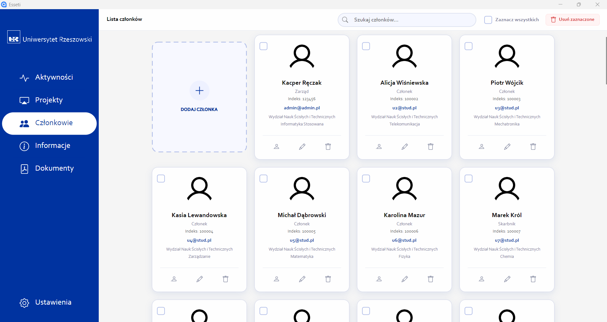
*Rysunek 3: Widok okna głównego i systemu nawigacji.*

### 4.3. Zarządzanie Członkami Kół
Moduł ewidencji studentów należących do organizacji. Pozwala na wyszukiwanie i filtrowanie członków według kierunku studiów, statusu aktywności czy przypisanych ról.

*Rysunek 4: Widok spisu członków koła naukowego.*

Moduł zawiera podgląd profilu szczegółowego oraz okno edycji formuły, w tym przypisywania ról organizacyjnych.

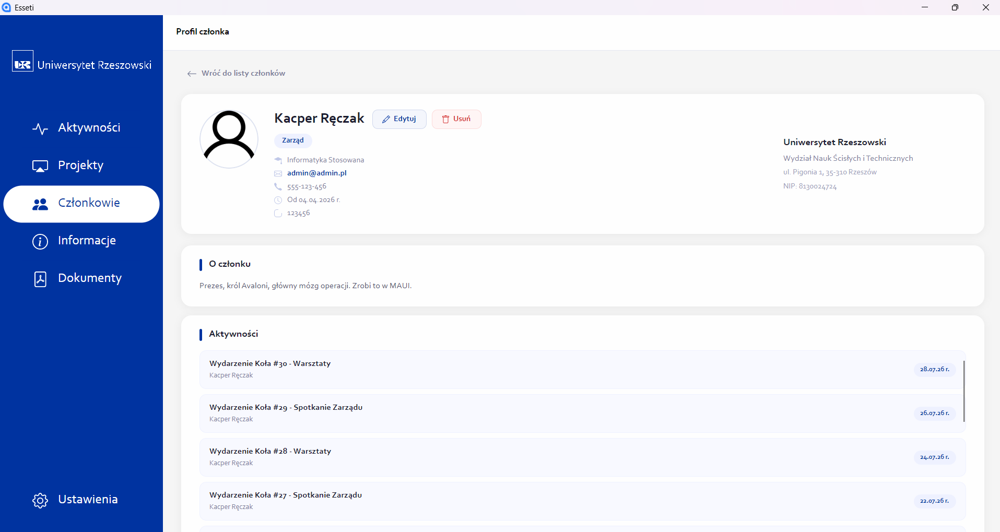
*Rysunek 5: Szczegółowe dane wybranego członka.*

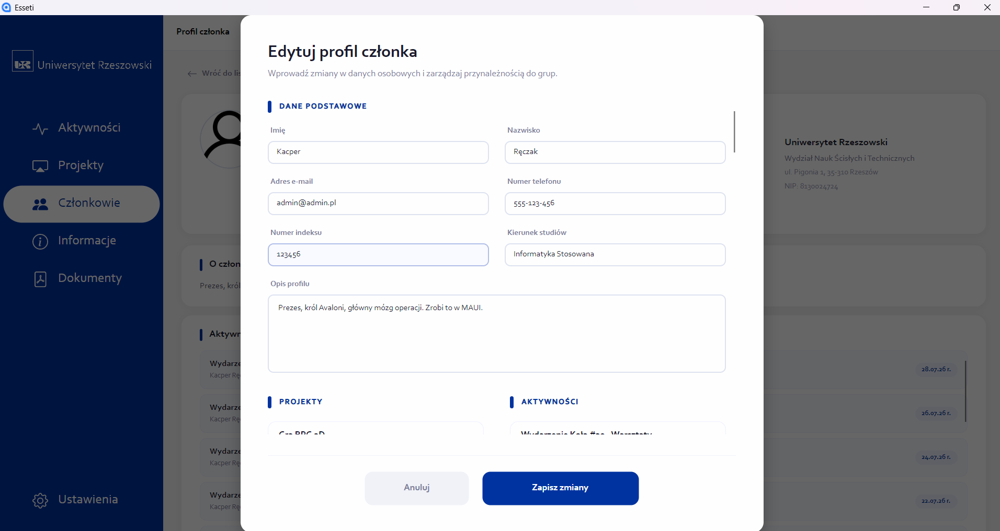
*Rysunek 6: Formularz modyfikacji danych personalnych i uprawnień.*

### 4.4. Ewidencja Projektów Naukowych
Rejestr projektów badawczych realizowanych przez koło. Umożliwia śledzenie szacowanego czasu realizacji, ram czasowych, przypisanie lidera projektu (osoby odpowiedzialnej), linku do repozytorium GitHub oraz zaangażowanych sekcji i kół partnerskich.

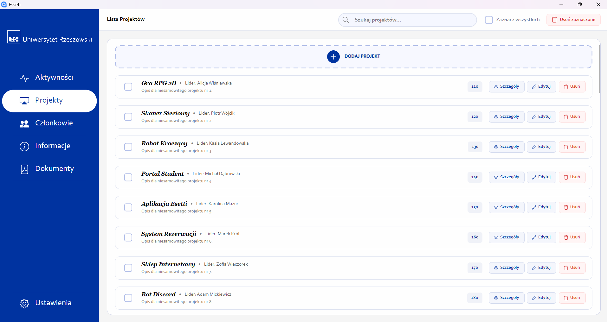
*Rysunek 7: Tabela projektów naukowo-badawczych.*

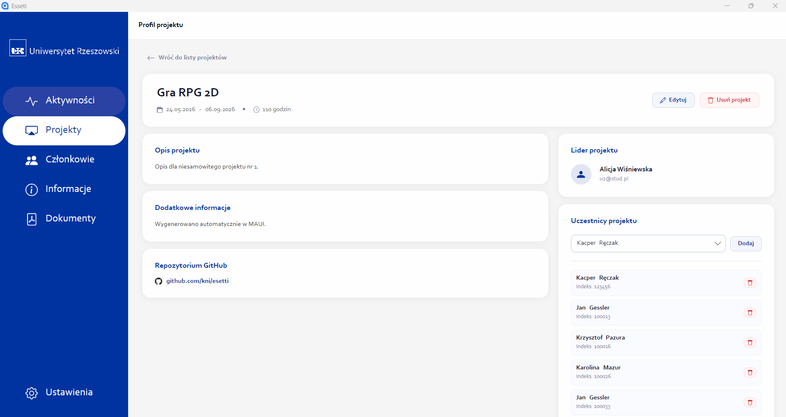
*Rysunek 8: Szczegółowe informacje o projekcie oraz lista uczestników.*

### 4.5. Rejestr Aktywności i Spotkań
Służy do planowania oraz dokumentowania bieżących spotkań, seminariów oraz warsztatów organizowanych przez członków koła.

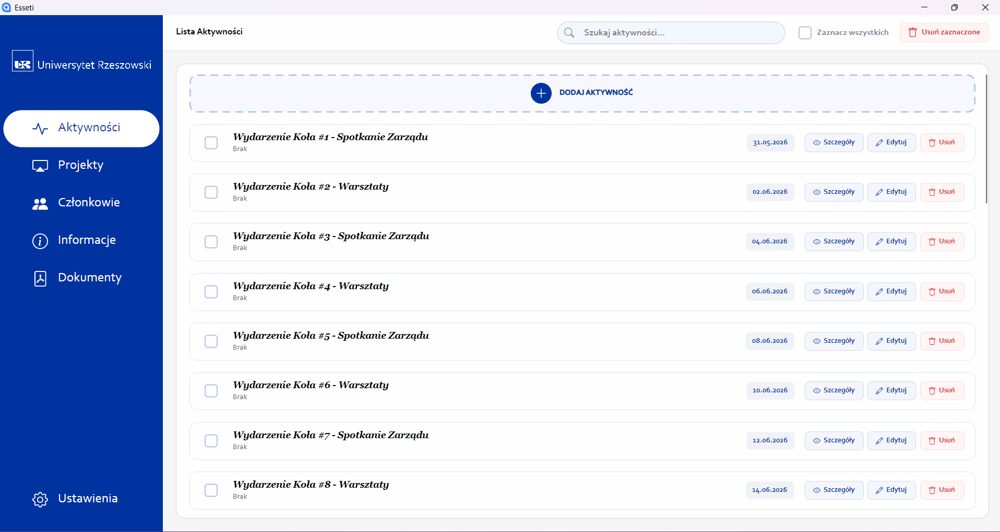
*Rysunek 9: Dziennik aktywności i spotkań.*

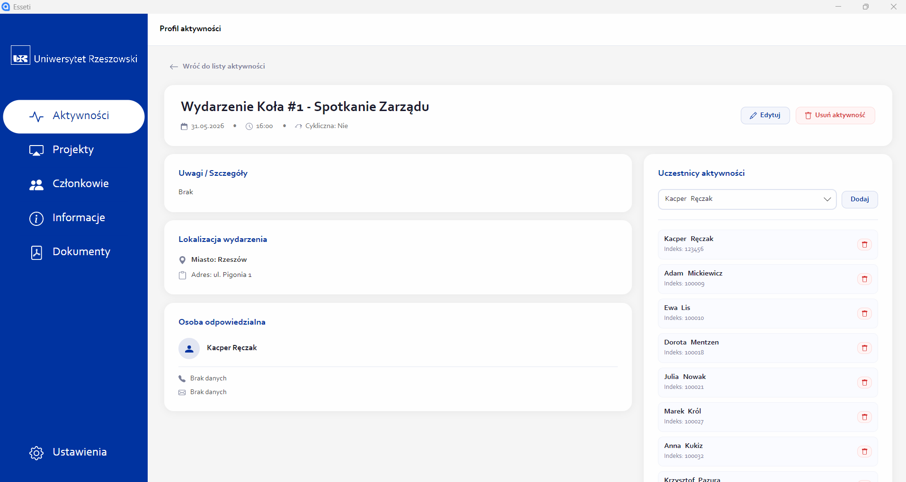
*Rysunek 10: Szczegółowe informacje o projekcie oraz lista uczestników.*

### 4.6. Informacje o Kole
Karta informacyjna koła prezentująca dane kontaktowe, wykaz opiekunów naukowych, harmonogram stałych spotkań oraz powiązania z jednostkami uczelni.

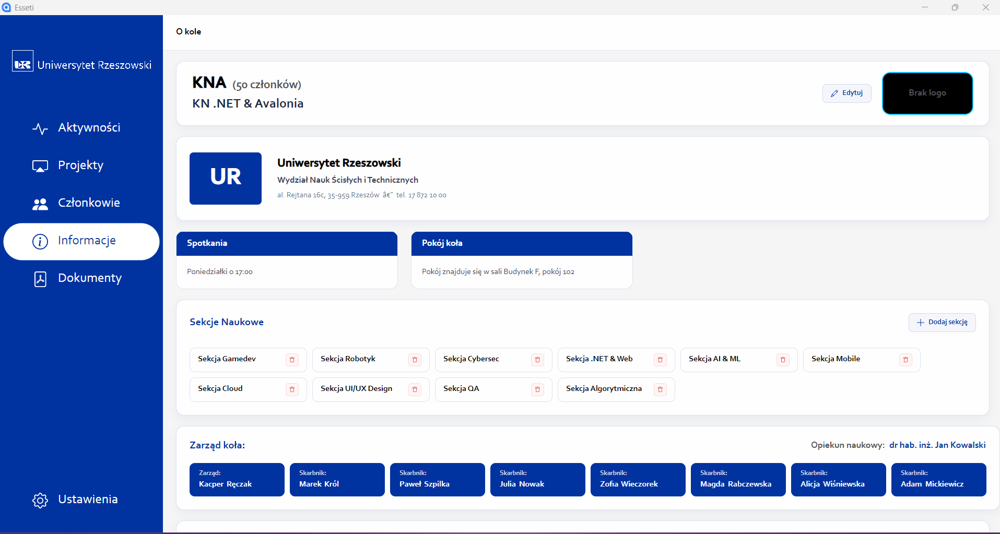
*Rysunek 11: Karta informacyjna koła naukowego.*

### 4.7. Moduł Generowania Dokumentów
Moduł odpowiedzialny za automatyczne tworzenie dokumentacji i eksportowanie jej do plików PDF za pomocą biblioteki QuestPDF. System udostępnia dwa kluczowe szablony raportowe:
1. **Generowanie listy członków:** Tworzy ustrukturyzowany dokument PDF zawierający skład zarządu koła naukowego, dane opiekuna naukowego oraz listę wszystkich członków wraz z klauzulą informacyjną RODO i miejscami na podpisy prezesa oraz opiekuna koła.
2. **Zaświadczenie o aktywności w kole:** Indywidualne zaświadczenie o udziale studenta w pracach koła w danym roku akademickim, ze szczegółowym wykazem osiągnięć, pełnionych funkcji oraz udziału w projektach badawczych.

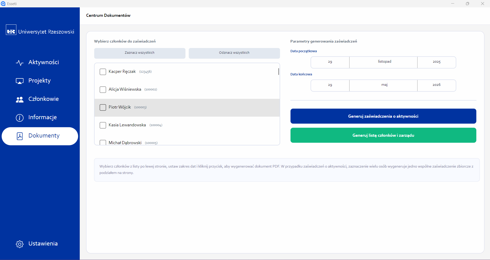
*Rysunek 12: Narzędzie eksportu i generowania plików PDF.*

### 4.8. Ustawienia i Zarządzanie Bazą Danych
Panel prezentujący zbiorcze statystyki aplikacji (liczba aktywnych członków, projektów, aktywności oraz wyjazdów) oraz oferujący funkcjonalności zarządzania bazą danych:
* **Kopia zapasowa:** Zrzut aktualnego stanu bazy danych `esseti.db` do zewnętrznego pliku w wybranej lokalizacji.
* **Import bazy:** Wczytanie zewnętrznej bazy danych w celu przywrócenia lub aktualizacji danych systemowych.

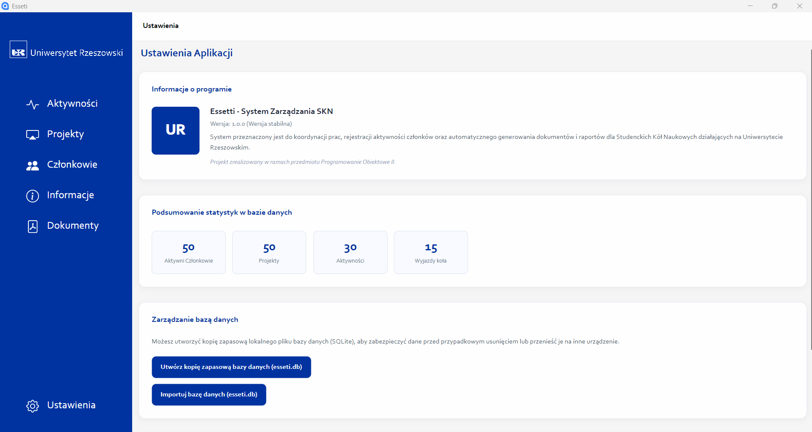
*Rysunek 13: Ekran konfiguracji i statystyk systemowych.*

## 5. Uruchomienie Aplikacji
Projekt został skompilowany i opublikowany do wersji wykonywalnej, co eliminuje konieczność instalacji dodatkowych narzędzi deweloperskich. W celu uruchomienia programu należy:

1. Pobrać spakowane archiwum z aplikacją.
2. Rozpakować zawartość archiwum ZIP do wybranego katalogu na dysku lokalnym.
3. Uruchomić plik wykonywalny **`Esseti.exe`**.
4. Przy pierwszym uruchomieniu aplikacja automatycznie zainicjuje plik bazy danych SQLite (`esseti.db` w podkatalogu `/Data`) oraz utworzy wymagane tabele i dane startowe.
