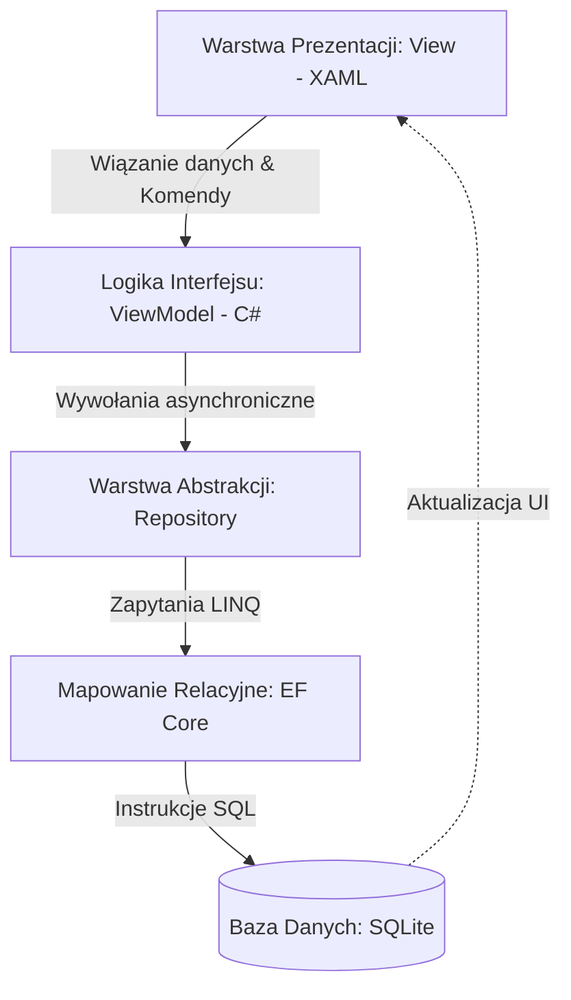
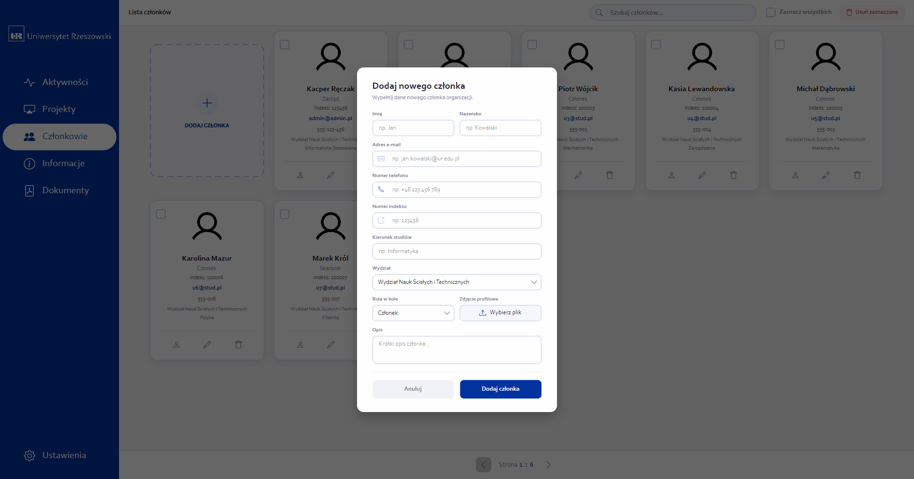
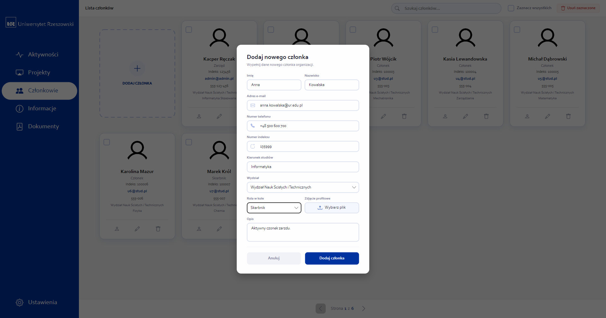
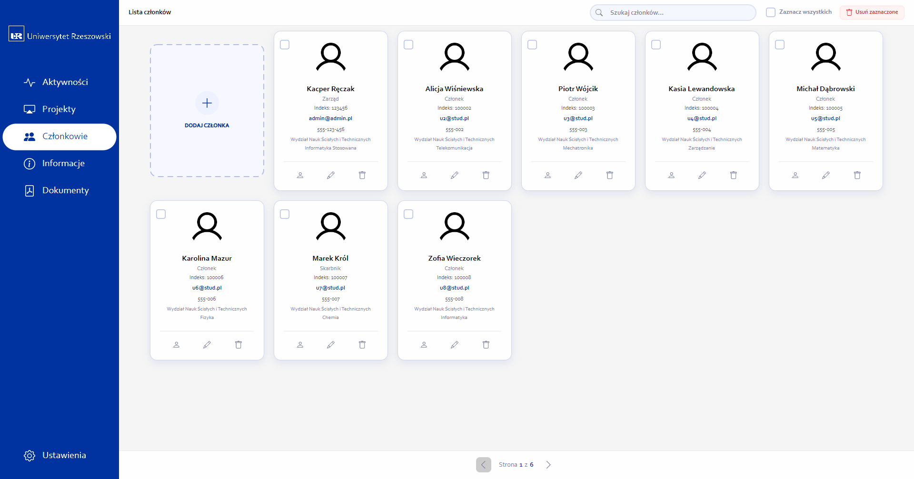
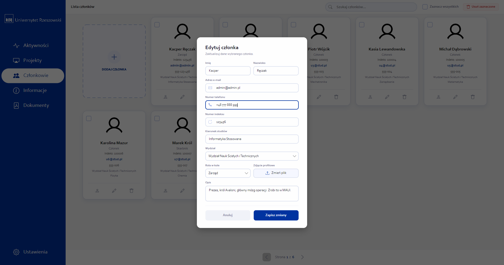
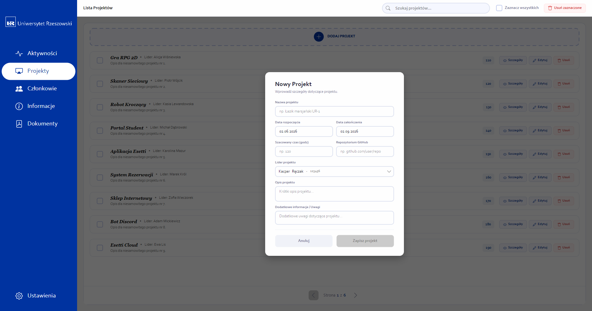
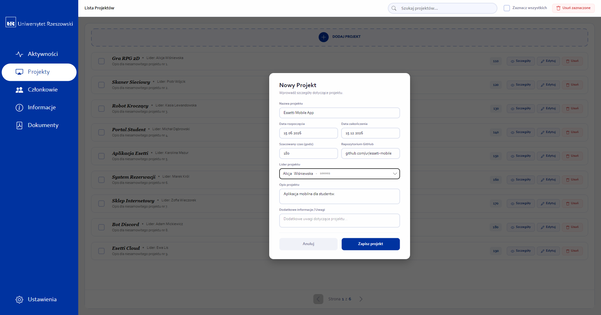
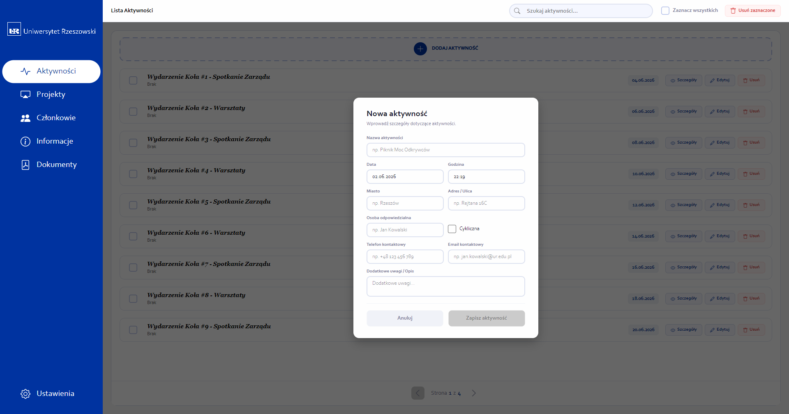
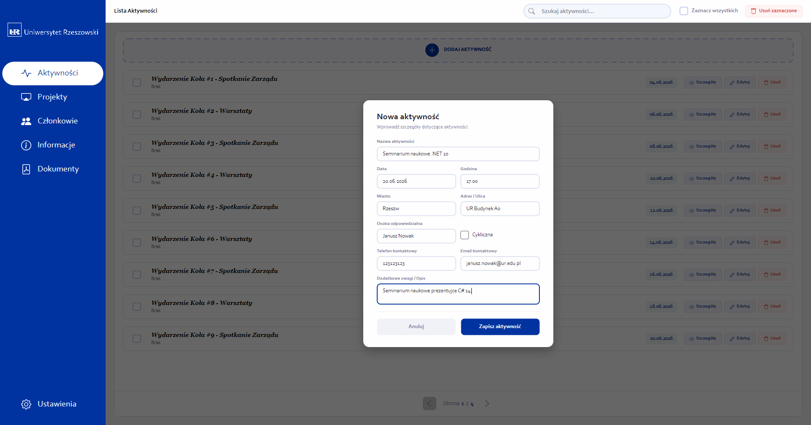
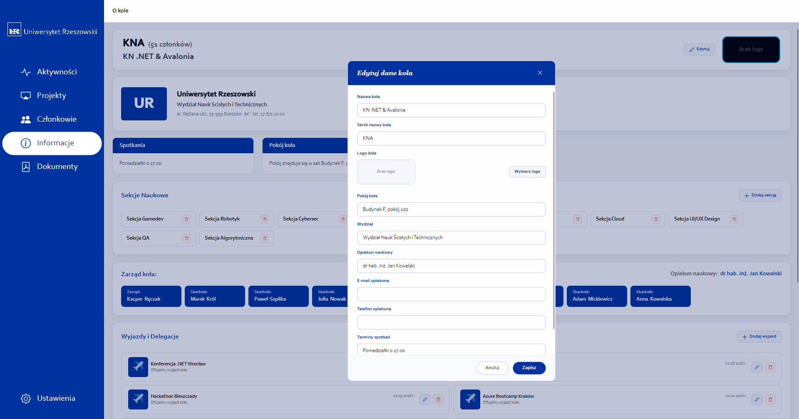

# Esetti - System Zarządzania Kołami Naukowymi i Generowania Dokumentacji

## Metadane Projektu
* **Uczelnia:** Uniwersytet Rzeszowski
* **Instytut:** Instytut Informatyki
* **Kierunek:** Informatyka, II rok
* **Przedmiot:** Programowanie Obiektowe 2 (lata akademickie 2025/2026)
* **Prowadzący:** mgr inż. Wojciech Gałka
* **Wykonawca:** Kacper Ręczak (Nr albumu: 134968)
* **Miejsce i rok:** Rzeszów, 2026

---

## 1. Wstęp i Cel Projektu
Projekt Esetti to innowacyjny system desktopowy przeznaczony do kompleksowego wspomagania działalności kół naukowych, którego architektura została zorientowana na pełną skalowalność międzyuczelnianą. Struktura powiązań bazy danych pozwala na jednoczesną, niezależną obsługę wielu uczelni wyższych oraz ich wydziałów, ułatwiając przy tym ewidencjonowanie wspólnych, wieloośrodkowych projektów badawczych i wyjazdów naukowych bez konieczności zmiany schematu danych.

Kluczowym elementem funkcjonalnym systemu jest moduł automatycznego generowania dokumentów i zaświadczeń w formacie PDF przy użyciu wydajnego silnika QuestPDF. Narzędzie to umożliwia natychmiastowe generowanie szczegółowych list członków koła wraz z pełną obsadą zarządu oraz klauzulami RODO, a także spersonalizowanych certyfikatów poświadczających aktywność studentów w projektach naukowych bezpośrednio na dysk lokalny użytkownika.

## 2. Architektura i Stos Technologiczny
Aplikacja została zaimplementowana w podziale na odrębne warstwy w celu zachowania wysokiej modularności i separacji odpowiedzialności:

### 2.1. Uzasadnienie Wyboru Technologii
* **C# i .NET 10.0:** Zapewnia wysoką wydajność, bezpieczeństwo typów oraz dostęp do potężnego ekosystemu bibliotek.
* **Avalonia UI:** Wybrana zamiast przestarzałego WPF ze względu na jej wieloplatformowość (działa na Windows, Linux, macOS) oraz nowoczesne podejście do renderowania UI.
* **SQLite:** Lekka, bezserwerowa relacyjna baza danych. Idealna dla aplikacji desktopowej, ponieważ nie wymaga od użytkownika instalacji i konfiguracji zewnętrznego serwera bazodanowego, oferując jednocześnie pełne wsparcie dla języka SQL.
* **QuestPDF:** Nowoczesna biblioteka do generowania dokumentów PDF z poziomu kodu (Fluent API), niewymagająca użycia powolnych silników konwersji HTML do PDF.

### 2.2. Zastosowane Wzorce Projektowe
Aplikacja jest zgodna z dobrymi praktykami programowania obiektowego (OOP) i w pełni wykorzystuje zaawansowane wzorce projektowe:
* **MVVM (Model-View-ViewModel):** Architektura oddzielająca logikę biznesową (ViewModel) od interfejsu użytkownika (View). Widoki są całkowicie pozbawione logiki, a interakcja odbywa się poprzez mechanizmy wiązania danych (Data Binding) oraz komendy (`RelayCommand` z pakietu `CommunityToolkit.Mvvm`).
* **Wstrzykiwanie Zależności (Dependency Injection - DI):** Zastosowano wbudowany kontener IoC (`Microsoft.Extensions.DependencyInjection`). Zapewnia to luźne powiązanie (loose coupling) pomiędzy klasami i odwrócenie sterowania. Serwisy i repozytoria są wstrzykiwane bezpośrednio do konstruktorów ViewModeli jako singletony lub instancje tymczasowe.
* **Wzorzec Repozytorium (Repository Pattern):** Dostęp do bazy danych został wyabstrahowany do dedykowanych klas repozytoriów (np. `ClubRepository`, `MemberRepository`). Ukrywa to logikę zapytań Entity Framework Core przed ViewModelami, ułatwiając potencjalną wymianę źródła danych na zewnętrzne API w przyszłości.

## 3. Struktura Bazy Danych i Skalowalność Międzyuczelniana
Schemat bazy danych (zdefiniowany w `EssetiDbContext`) uwzględnia architekturę wielodostępną (multi-tenant) na poziomie struktur akademickich:

* **Struktura Uczelniana (`College` $\rightarrow$ `CollegeDepartment` $\rightarrow$ `ClubInfo`):** System wspiera definicję wielu uczelni, z których każda dzieli się na wydziały, a te z kolei grupują poszczególne koła naukowe.
* **Współpraca Międzyuczelniana w Projektach:** Encje takie jak `Project` oraz `Trip` są powiązane relacjami wiele-do-wielu z encją `ClubInfo` (tabele łączące). Pozwala to na realizację projektów partnerskich, w których uczestniczą członkowie z różnych kół naukowych, także z różnych uczelni.
* **Członkostwo i Uprawnienia (`Member`, `UserAccount`, `AuthorityRole`, `MemberClub`):** Użytkownik posiada jedno konto systemowe (`UserAccount`), lecz może być przypisany do wielu kół naukowych z różnymi poziomami uprawnień i rolami (np. prezes w jednym kole, a zwykły członek w innym) poprzez tabelę łączącą `MemberClub`.

### 3.1. Szczegółowy Opis Schematu Bazy Danych (O/RM)
Baza danych składa się z tabel reprezentujących strukturę uczelnianą, dane użytkowników oraz logikę operacyjną kół naukowych. Relacje wiele-do-wielu zostały zaimplementowane za pomocą tabel pośredniczących (łączących).

*Rysunek 1: Schemat relacji bazy danych systemu Esetti.*

#### 3.1.1. Tabele Struktur Akademickich
* **`college` (Uczelnia):**
  * `college_id` (PK, int): Unikalny identyfikator uczelni.
  * `name` (string): Pełna nazwa uczelni.
  * `name_short` (string): Skrócona nazwa uczelni.
  * `college_avatar` (blob/byte[]): Logotyp uczelni.
  * `address_line`, `city`, `postal_code` (string): Dane adresowe siedziby.
  * `phone` (string): Numer telefonu kontaktowego.
  * `NIP` (string): Numer Identyfikacji Podatkowej.
* **`college_department` (Wydział):**
  * `college_department_id` (PK, int): Unikalny identyfikator wydziału.
  * `college_id` (FK, int): Powiązanie z tabelą `college`.
  * `name` (string): Pełna nazwa wydziału.
  * `address_line`, `city`, `postal_code`, `phone`, `email` (string): Dane adresowe i kontaktowe wydziału.
* **`club_info` (Koło Naukowe):**
  * `club_id` (PK, int): Unikalny identyfikator koła.
  * `name` (string): Pełna nazwa koła naukowego.
  * `department_id` (FK, int): Powiązanie z wydziałem (`college_department`).
  * `club_room` (string): Sala/pokój przypisany do koła.
  * `supervisor_name`, `supervisor_email`, `supervisor_phone` (string): Dane opiekuna koła.
  * `meetings_schedule` (string): Harmonogram cyklicznych spotkań.
  * `short_name` (string): Skrócona nazwa koła.
  * `club_photo` (blob/byte[]): Zdjęcie/logotyp koła naukowego.

#### 3.1.2. Tabele Użytkowników i Uprawnień
* **`user_account` (Konto Użytkownika):**
  * `account_id` (PK, int): Unikalny identyfikator konta.
  * `email` (string): Adres e-mail (login, unikalny).
  * `password_hash` (string): Zahaszowane hasło dostępowe.
  * `system_role` (string): Rola w systemie (np. SuperAdmin, CollegeAdmin, User).
  * `is_verified` (bool): Flaga weryfikacji konta.
  * `created_at`, `last_login`, `updated_at` (datetime): Metadane dotyczące aktywności na koncie.
* **`member` (Członek Koła):**
  * `member_id` (PK, int): Unikalny identyfikator członka.
  * `account_id` (FK, int): Opcjonalne powiązanie z kontem logowania (`user_account`).
  * `role_id` (FK, int): Powiązanie z uprawnieniami w kole (`authority_role`).
  * `index_number` (string): Numer albumu (indeksu).
  * `first_name`, `last_name` (string): Dane personalne.
  * `major` (string): Kierunek studiów.
  * `phone_number` (string): Telefon kontaktowy.
  * `member_avatar` (blob/byte[]): Zdjęcie profilowe.
  * `description` (string): Krótki opis/biografia członka.
  * `is_active` (bool): Status aktywności w kole.
  * `join_date` (datetime): Data dołączenia do organizacji.
* **`authority_role` (Role i Uprawnienia):**
  * `role_id` (PK, int): Unikalny identyfikator roli.
  * `name` (string): Nazwa roli (unikalna).
  * `description` (string): Szczegółowy opis.
  * `permissions` (string): Uprawnienia przypisane do roli.

#### 3.1.3. Tabele Działań i Operacji
* **`project` (Projekt Badawczy):**
  * `project_id` (PK, int): Unikalny identyfikator projektu.
  * `name` (string): Nazwa projektu.
  * `description`, `additional_information` (string): Opis oraz informacje dodatkowe.
  * `person_in_charge_id` (FK, int): Powiązanie z członkiem koła pełniącym funkcję kierownika projektu (`member`).
  * `github` (string): Link do repozytorium kodu.
  * `estimated_time` (int): Szacowany czas realizacji (np. w godzinach).
  * `date_start`, `date_end` (datetime): Ramy czasowe projektu.
  * `is_active` (bool): Status aktywności projektu.
* **`section` (Sekcja Koła):**
  * `section_id` (PK, int): Unikalny identyfikator sekcji.
  * `name` (string): Nazwa sekcji (np. sekcja programistyczna).
  * `short_name` (string): Nazwa skrócona.
  * `meetings` (string): Terminy spotkań sekcji.
  * `created_at` (datetime): Data utworzenia.
  * `is_active` (bool): Status aktywności.
* **`activity` (Wydarzenie/Aktywność):**
  * `activity_id` (PK, int): Unikalny identyfikator aktywności.
  * `name` (string): Nazwa wydarzenia.
  * `address_line`, `city`, `postal_code` (string): Dane lokalizacji wydarzenia.
  * `date`, `time` (datetime/string): Data i godzina wydarzenia.
  * `person_in_charge_name`, `person_in_charge_phone`, `person_in_charge_email` (string): Dane koordynatora wydarzenia.
  * `additional_information` (string): Informacje organizacyjne.
  * `is_repeatable` (bool): Czy wydarzenie jest cykliczne.
  * `is_active` (bool): Status aktywności.
* **`trip` (Wyjazd Naukowy):**
  * `trip_id` (PK, int): Unikalny identyfikator wyjazdu.
  * `name` (string): Nazwa/cel wyjazdu.
  * `description` (string): Opis wyjazdu.
  * `trip_photo` (blob/byte[]): Zdjęcie powiązane z wyjazdem.
  * `date` (datetime): Data wyjazdu.

#### 3.1.4. Tabele Pośredniczące (Wiele-do-Wielu)
* **`account_college`:** Łączy konta użytkowników z uczelniami (`account_id` + `college_id`).
* **`member_club`:** Przypisuje członka do konkretnego koła naukowego wraz ze zdefiniowaną rolą (`club_role`).
* **`section_member`:** Przypisuje członka do sekcji ze zdefiniowaną rolą w sekcji (`role`).
* **`project_club`:** Powiązanie projektów z wieloma kołami naukowymi (kluczowe dla projektów międzyuczelnianych).
* **`project_member`:** Lista członków biorących udział w danym projekcie.
* **`project_sections`:** Lista sekcji biorących udział w projekcie.
* **`activity_member`:** Lista członków biorących udział w wydarzeniu/aktywności.
* **`club_trip`:** Powiązanie wyjazdów naukowych z kołami.

## 4. Moduły Aplikacji i Prezentacja Interfejsu
Poniżej opisano podstawowe ekrany systemu wraz z pełnym cyklem życia i operacjami CRUD.

### 4.1. Pulpit Nawigacyjny (Dashboard)
Ekran startowy agregujący podstawowe powiadomienia, listę aktualnie prowadzonych przez koło prac oraz skróty ułatwiające nawigację.

*Rysunek 2: Pulpit startowy aplikacji.*

### 4.2. Okno Główne i Nawigacja
Odpowiada za całościowy layout aplikacji, wyświetlając menu boczne do przełączania aktywnych modułów zarządzanych przez dedykowany serwis nawigacji.

*Rysunek 3: Widok okna głównego i systemu nawigacji.*

### 4.3. Zarządzanie Członkami Kół (Pełny cykl CRUD)
Moduł ewidencji studentów należących do organizacji. Pozwala na wyszukiwanie i filtrowanie członków według kierunku studiów, statusu aktywności czy przypisanych ról.

*Rysunek 4: Widok spisu członków koła naukowego.*

#### Krok 1: Dodawanie nowego członka (popup)
Wybór opcji dodawania otwiera dedykowany panel z polami na dane osobowe, e-mail, telefon oraz role organizacyjne.

*Rysunek 5: Pusty formularz dodawania nowego członka.*

*Rysunek 6: Formularz uzupełniony o dane kandydata.*

#### Krok 2: Lista członków po dodaniu nowego rekordu
Po zapisaniu, nowy członek pojawia się w ustrukturyzowanej liście w postaci kafelka profilowego.

*Rysunek 7: Zaktualizowana lista członków koła naukowego.*

#### Krok 3: Edycja danych członka koła
Pozwala na modyfikację numeru telefonu oraz innych kluczowych danych personalnych i roli akademickiej.

*Rysunek 8: Formularz edycji danych członka.*

*Rysunek 9: Zmodyfikowany numer telefonu w oknie edycji.*

#### Krok 4: Lista po edycji i zapisaniu zmian
Zaktualizowane informacje o telefonie i danych kontaktowych są natychmiast widoczne na kafelkach profilowych.

*Rysunek 10: Lista członków po zapisaniu wprowadzonych modyfikacji.*

### 4.4. Ewidencja Projektów Naukowych
Rejestr projektów badawczych realizowanych przez koło. Umożliwia śledzenie szacowanego czasu realizacji, lidera projektu oraz zaangażowanych sekcji i kół partnerskich.

*Rysunek 11: Tabela projektów naukowo-badawczych.*

#### Dodawanie i edycja projektu
Panel dodawania i edycji pozwala na zdefiniowanie nazwy, ram czasowych, lidera projektu oraz linku do repozytorium GitHub.

*Rysunek 12: Pusty formularz rejestracji projektu.*

*Rysunek 13: Wypełnione dane nowego projektu.*

*Rysunek 14: Widok tabeli projektów z nowo dodanym rekordem.*

### 4.5. Rejestr Aktywności i Spotkań
Służy do planowania oraz dokumentowania bieżących spotkań, seminariów oraz warsztatów organizowanych przez członków koła.

*Rysunek 15: Dziennik aktywności i spotkań.*

#### Dodawanie aktywności
Umożliwia pełne zdefiniowanie terminu, koordynatora, lokalizacji oraz opisu planowanego spotkania.

*Rysunek 16: Formularz rejestracji nowego wydarzenia.*

*Rysunek 17: Uzupełnione szczegóły organizacyjne aktywności.*

*Rysunek 18: Lista aktywności z nowym spotkaniem.*

### 4.6. Informacje o Kole
Karta informacyjna koła prezentująca dane kontaktowe wydziału, wykaz opiekunów naukowych, harmonogram stałych spotkań oraz sekcje naukowe i wyjazdy.

*Rysunek 19: Karta informacyjna koła naukowego.*

#### Przewijanie i Edycja informacji koła
Przewinięcie widoku w dół ujawnia sekcję zarządu, dane opiekuna naukowego oraz listę wyjazdów.

*Rysunek 20: Sekcja opiekuna naukowego i zarządu koła.*

System pozwala również na edycję tych danych, w tym zmianę logotypu koła, pokoju, wydziału oraz danych kontaktowych opiekuna naukowego.

*Rysunek 21: Formularz edycji danych koła naukowego.*

*Rysunek 22: Zaktualizowane dane teleadresowe opiekuna koła w formularzu.*

### 4.7. Moduł Generowania Dokumentów
Moduł odpowiedzialny za automatyczne tworzenie dokumentacji i eksportowanie jej do plików PDF za pomocą silnika QuestPDF.

*Rysunek 23: Panel generowania zestawień i zaświadczeń PDF.*

### 4.8. Ustawienia i Zarządzanie Bazą Danych (Kopia zapasowa i Import)
Panel prezentujący zbiorcze statystyki aplikacji (liczba aktywnych członków, projektów, aktywności oraz wyjazdów) oraz oferujący funkcjonalności importu i eksportu bazy SQLite.

*Rysunek 24: Ekran konfiguracji i statystyk systemowych.*

## 5. Uruchomienie Aplikacji i Ograniczenia
Aplikacja Esetti dystrybuowana jest jako gotowy, przenośny pakiet wykonywalny dla systemu operacyjnego Windows, co minimalizuje trudności związane z instalacją środowiska produkcyjnego.

### 5.1. Wymagania Systemowe
Przed pierwszym uruchomieniem należy upewnić się, że system operacyjny spełnia poniższe wymagania:
* **System operacyjny:** Windows 10 (wersja 1809 lub nowsza) lub Windows 11.
* **Środowisko uruchomieniowe:** Zainstalowany pakiet redystrybucyjny `.NET Desktop Runtime 9.0` (wersja x64).
* **Wolne miejsce na dysku:** Minimum 100 MB na pliki bazy danych i logotypy kół.
* **Uprawnienia:** Prawa do odczytu i zapisu w katalogu uruchomieniowym aplikacji (niezbędne do wykreowania pliku bazy SQLite).

### 5.2. Pierwsze Uruchomienie
W celu zainicjowania działania systemu należy postępować zgodnie z poniższymi krokami:
1. Pobrać spakowane archiwum ZIP zawierające skompilowaną aplikację.
2. Rozpakować całą zawartość archiwum do wybranego folderu lokalnego na dysku (zaleca się unikania folderów chronionych przez system, np. `Program Files`, ze względu na wymóg zapisu bazy danych).
3. Kliknąć dwukrotnie na plik wykonywalny **`Esseti.exe`**.
4. Podczas pierwszego uruchomienia system wykryje brak pliku bazy danych i automatycznie utworzy podkatalog `/Data` oraz zainicjuje plik `esseti.db`.
5. Zostaną automatycznie zaaplikowane migracje Entity Framework Core oraz uruchomiony seeder bazy danych, uzupełniający tabele o testowe dane startowe (w tym przykładowych członków, projekty oraz wydziały).

### 5.3. Znane Ograniczenia Systemowe
W obecnej wersji aplikacji występują następujące ograniczenia funkcjonalne i techniczne:
* **Lokalna baza danych:** Silnik SQLite nie wspiera współbieżnego dostępu z wielu niezależnych maszyn w sieci. Wszystkie edycje muszą być dokonywane lokalnie na danej instancji bazy.
* **Restart podczas importu:** Z powodu specyfiki działania biblioteki Entity Framework Core, która blokuje plik bazy danych podczas aktywności aplikacji, sfinalizowanie importu zewnętrznej bazy wymaga ręcznego ponownego uruchomienia programu.
* **Wielkość plików logo:** Pliki graficzne logo kół naukowych są zapisywane jako typ `blob` bezpośrednio w bazie danych. Wrzucanie bardzo dużych zdjęć (powyżej 5 MB) może powodować wzrost rozmiaru bazy danych i spadek wydajności wczytywania szczegółów koła.

## 6. Weryfikacja Systemu (Instrukcja Testowa)
Poniższa sekcja zawiera procedury testowe służące do weryfikacji poprawności działania kluczowych modułów aplikacji Esetti.

### 6.1. Procedura Testowa: Cykl CRUD Członka Koła
W celu zweryfikowania poprawności dodawania, edycji oraz zapisu studentów, należy wykonać następujące kroki:
1. Przejdź do zakładki **Członkowie** za pomocą menu bocznego.
2. Kliknij kafelek **DODAJ CZŁONKA** i upewnij się, że przycisk potwierdzenia jest zablokowany.
3. Wypełnij pola poprawnymi danymi (np. Jan, Nowak, `jan.nowak@ur.edu.pl`, telefon: `123456789`, indeks: `123456`). Upewnij się, że przycisk odblokowuje się po poprawnym wpisaniu danych.
4. Kliknij **Dodaj członka** i zweryfikuj, czy karta nowego członka pojawiła się na końcu listy.
5. Kliknij ikonę **Edytuj** (ołówka) na nowo utworzonej karcie członka.
6. Zmień numer telefonu w polu formularza i kliknij **Zapisz zmiany**.
7. Sprawdź, czy numer telefonu zaktualizował się na kafelku profilowym.
8. Kliknij ikonę **Usuń** (kosza) i potwierdź operację. Karta członka powinna zniknąć z listy.

### 6.2. Procedura Testowa: Generowanie Dokumentów PDF
W celu potwierdzenia bezbłędnej pracy silnika QuestPDF należy przejść przez poniższe kroki:
1. Przejdź do zakładki **Dokumenty**.
2. Kliknij przycisk **Generuj listę członków**.
3. Wybierz lokalizację na dysku do zapisu pliku i kliknij **Zapisz**.
4. Otwórz wygenerowany plik PDF i sprawdź, czy zawiera on kompletny wykaz członków, w tym ich przypisane numery telefonów oraz stopkę z polami na podpisy władz koła.
